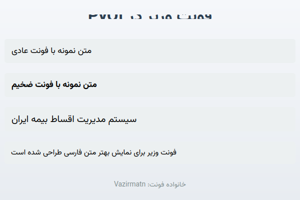

# Vazir Font Integration

This document describes the implementation of Vazir font support in the PyQt application.

## Overview

The application now uses the Vazir font (Vazirmatn) for better Persian/Farsi text display across all UI components.

## Implementation Details

### 1. Assets Folder Structure

```
/assets
├── Vazir-Regular.ttf    (122 KB)
├── Vazir-Bold.ttf       (123 KB)
├── Vazir-Medium.ttf     (120 KB)
└── Vazir-Light.ttf      (122 KB)
```

All font files are stored in the `assets` folder in the project root directory.

### 2. Font Loading (main.py)

The `load_vazir_font()` function in `main.py` handles loading the Vazir font files:

- Locates the assets folder relative to the main.py file
- Iterates through all Vazir font variants (Regular, Bold, Medium, Light)
- Uses `QFontDatabase.addApplicationFont()` to load each font file
- Returns the font family name (e.g., "Vazirmatn") if successful
- Provides fallback to "Tahoma" if font loading fails

The font is applied globally to the QApplication in the `main()` function, ensuring all widgets inherit the Vazir font by default.

### 3. MainWindow Font Application (src/ui/main_window.py)

The `apply_vazir_font()` method in MainWindow provides additional font loading for cases where the window is created independently:

- Checks if Vazir font is already loaded in the system
- Loads fonts from assets folder if not already available
- Applies the font to the main window
- Falls back to Tahoma if Vazir font is unavailable

### 4. Font Family Name

The actual font family name is "Vazirmatn" (not "Vazir"), which is detected automatically from the font files. The code dynamically retrieves this name from `QFontDatabase.applicationFontFamilies()`.

## Testing

Several test files have been created to verify the font integration:

### test_vazir_font.py
Tests basic font loading functionality:
- Font file existence
- Font loading with QFontDatabase
- Font availability
- QFont creation
- Application of font to QApplication

### test_main_font_logic.py
Tests the font loading logic in main.py:
- QApplication creation
- load_vazir_font() function
- Font application to application
- Widget font inheritance

### test_app_font_integration.py
Tests complete application integration (requires all dependencies)

### demo_vazir_font.py
Creates a visual demonstration of the Vazir font with Persian text samples

## Usage

The font is loaded automatically when the application starts. No additional configuration is required.

```python
# The font is loaded in main.py
font_loaded, font_family_name = load_vazir_font()
if font_loaded and font_family_name:
    font = QFont(font_family_name, 10)
    app.setFont(font)
```

## Fallback Behavior

If Vazir font files are not found or cannot be loaded:
- The application will log a warning
- The system will fall back to using "Tahoma" font
- The application will continue to function normally

## Benefits

1. **Better Persian Text Rendering**: Vazir font is specifically designed for Persian/Farsi text
2. **Consistent Typography**: All UI components use the same font family
3. **Professional Appearance**: Modern, clean font design
4. **Multiple Weights**: Regular, Bold, Medium, and Light variants available
5. **Fallback Support**: Graceful degradation if fonts are unavailable

## Font Information

- **Font Name**: Vazirmatn
- **Source**: [rastikerdar/vazir-font](https://github.com/rastikerdar/vazir-font)
- **License**: Open Font License (OFL)
- **Variants**: Regular, Bold, Medium, Light
- **Format**: TrueType Font (.ttf)

## Files Modified

- `main.py`: Added `load_vazir_font()` function and global font application
- `src/ui/main_window.py`: Updated `apply_vazir_font()` method to use QFontDatabase
- Created `assets/` folder with Vazir font files
- Added test files for verification

## Screenshot



The screenshot shows Persian text rendered with the Vazir font in various sizes and weights.
